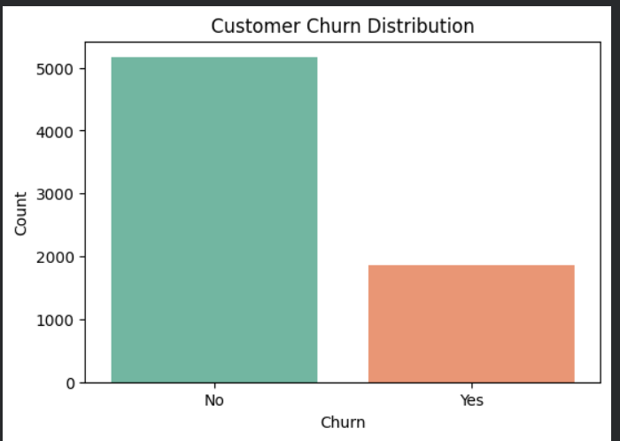
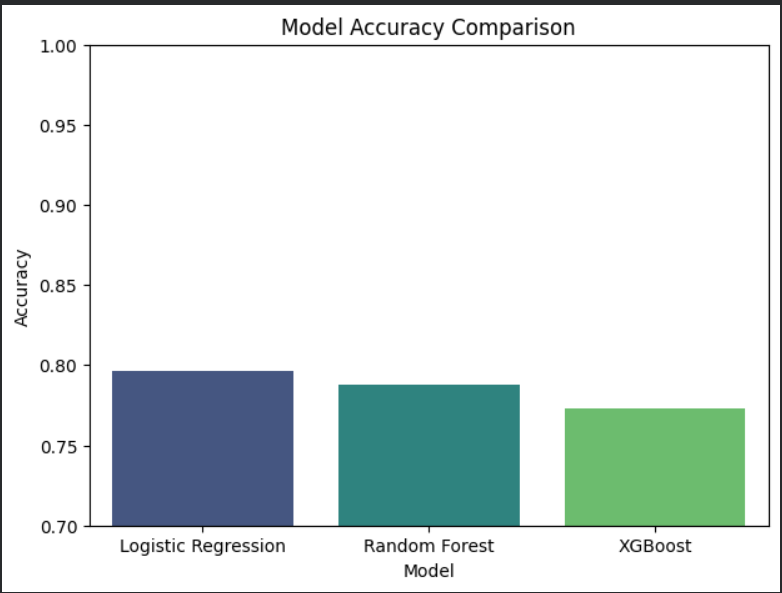
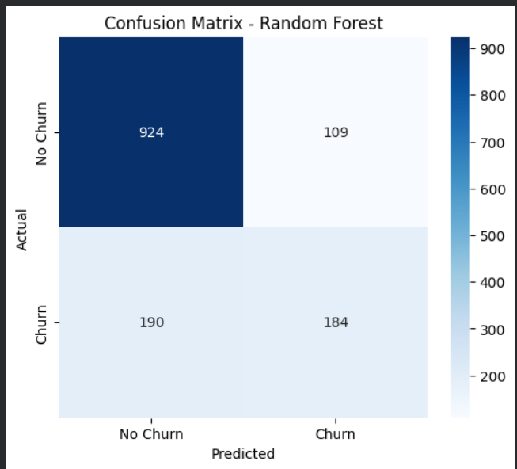
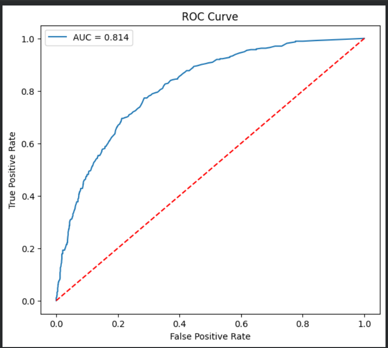
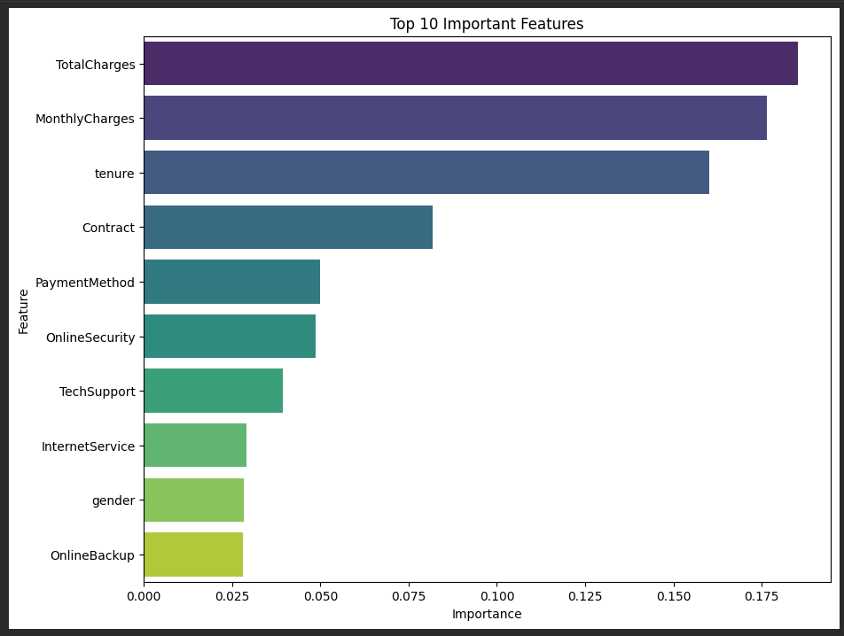

# 📊 Customer Churn Prediction using Machine Learning


## 📌 Project Overview

Customer churn is one of the biggest challenges for telecom companies. This project predicts whether a customer is likely to leave a service using Machine Learning algorithms.

The project includes complete data preprocessing, exploratory data analysis (EDA), feature engineering, model training, evaluation, and comparison of multiple machine learning models.

---

## 🎯 Objectives

- Predict customer churn accurately.
- Identify factors responsible for customer churn.
- Compare multiple Machine Learning models.
- Visualize customer behavior using charts.
- Recommend the best performing model.

---

## 📂 Dataset

**Dataset:** Telco Customer Churn Dataset

**Features:** 21

**Records:** 7043 Customers

Target Variable:

- Churn (Yes / No)

---

## 🛠️ Technologies Used

- Python
- Pandas
- NumPy
- Matplotlib
- Seaborn
- Scikit-Learn
- XGBoost
- Joblib

---

## ⚙️ Machine Learning Workflow

```
Data Collection
        ↓
Data Cleaning
        ↓
EDA
        ↓
Feature Engineering
        ↓
Train/Test Split
        ↓
Model Training
        ↓
Model Evaluation
        ↓
Model Comparison
        ↓
Save Best Model
```

---

## 🤖 Models Used

- Logistic Regression
- Random Forest Classifier
- XGBoost Classifier

---

## 📊 Evaluation Metrics

- Accuracy
- Precision
- Recall
- F1 Score
- ROC-AUC Score

---

## 📈 Results

| Model | Accuracy |
|--------|----------|
| Logistic Regression | ~79.6% |
| Random Forest | Best Model |
| XGBoost | Competitive Performance |

Random Forest achieved the best overall performance on this dataset.

---

# 📷 Project Screenshots

## Customer Churn Distribution



---

## Model Accuracy Comparison



---

## Confusion Matrix



---

## ROC Curve



---

## Feature Importance



---

## 📁 Project Structure

```
Customer-Churn-Prediction/
│
├── Customer_Churn_Prediction.ipynb
├── customer_churn_model.pkl
├── README.md
├── requirements.txt
├── Telco-Customer-Churn.csv
│
└── images/
    ├── churn_distribution.png
    ├── accuracy_comparison.png
    ├── confusion_matrix.png
    ├── roc_curve.png
    └── feature_importance.png
```

---

## 🚀 How to Run

### 1️⃣ Clone the Repository

```bash
git clone https://github.com/YOUR_USERNAME/Customer-Churn-Prediction.git
```

### 2️⃣ Install Dependencies

```bash
pip install -r requirements.txt
```

### 3️⃣ Run the Notebook

Open:

```
Customer_Churn_Prediction.ipynb
```

Run all cells sequentially.

---

## 📌 Future Improvements

- Hyperparameter Tuning
- Cross Validation
- Streamlit Web App
- Deep Learning Model
- Real-Time Predictions

---

## 👩‍💻 Author

**Anushka Sharma**

B.Tech Student

Machine Learning & Data Analytics Enthusiast

---

## ⭐ If you found this project useful, consider giving it a Star!
